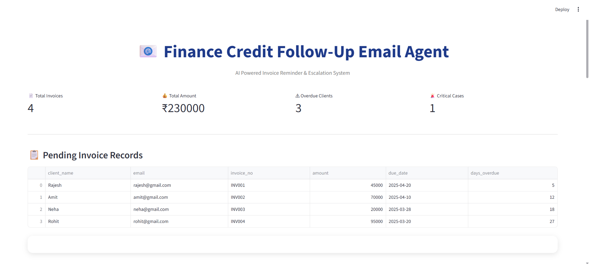
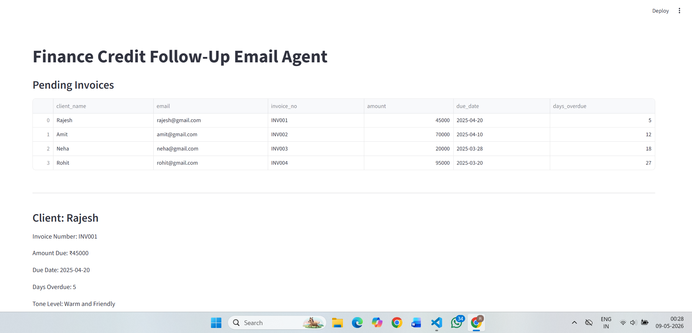
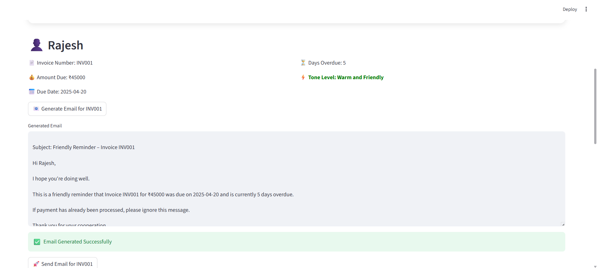

# 📧 Finance Credit Follow-Up Email Agent

## 📌 Project Overview

The Finance Credit Follow-Up Email Agent is an AI-inspired automation system developed to help finance teams manage overdue invoice follow-ups efficiently.

The system automatically:
- Reads pending invoice records from CSV data
- Detects overdue payments
- Applies tone escalation logic
- Generates professional follow-up emails
- Simulates email sending
- Maintains audit logs for tracking and review

This project was developed as part of the AI Enablement Internship Project Challenge.

---

# 🚀 Features

✅ CSV Data Ingestion  
✅ Dynamic Tone Escalation  
✅ Automated Email Generation  
✅ Send Simulation Mode  
✅ Audit Trail Logging  
✅ Escalation Handling  
✅ Interactive Streamlit Dashboard  
✅ Colorful Professional UI  

---

# 🧠 Tone Escalation Logic

| Days Overdue | Tone |
|---|---|
| 1–7 Days | Warm and Friendly |
| 8–14 Days | Polite but Firm |
| 15–21 Days | Formal and Serious |
| 22–30 Days | Stern and Urgent |
| 30+ Days | Escalate to Legal Team |

---

# 🛠 Tech Stack

| Layer | Technology |
|---|---|
| Frontend UI | Streamlit |
| Backend | Python |
| Data Handling | Pandas |
| Logging | Text File Logging |
| Data Source | CSV |
| IDE | VS Code |

---

# 📂 Project Structure

```bash
finance-email-agent/
│
├── app.py
├── data.csv
├── logs.txt
├── requirements.txt
├── README.md
└── .gitignore
```

---

# ⚙ Installation & Setup

## 1️⃣ Clone Repository

```bash
git clone <your-github-link>
```

## 2️⃣ Open Project Folder

```bash
cd finance-email-agent
```

## 3️⃣ Install Dependencies

```bash
pip install -r requirements.txt
```

## 4️⃣ Run Project

```bash
python -m streamlit run app.py
```

---

# 📊 Workflow

```text
CSV Invoice Data
        ↓
Tone Escalation Engine
        ↓
Email Generation
        ↓
Send Simulation
        ↓
Audit Logging
```

---

# 🔐 Security Mitigations

## Prompt Injection Prevention
- Input validation applied on invoice records
- Fixed structured email templates used

## API Key Protection
- `.env` excluded using `.gitignore`
- No hardcoded secrets

## Data Privacy
- Mock customer data used
- No real financial information stored

## Hallucination Prevention
- Template-based email generation
- Controlled escalation logic

## Email Spoofing Prevention
- Dry-run simulation mode enabled
- No real email delivery during testing

---

# 📸 Screenshots

## Dashboard


## Generated Email


## Send Simulation

---

# 📝 Sample Log Entry

```text
2026-05-09 10:22:11 | INV001 | EMAIL GENERATED
2026-05-09 10:22:25 | INV001 | EMAIL SENT
```

---

# 🔮 Future Improvements

- Real SMTP Email Integration
- AI-Based Email Personalization
- Payment Prediction System
- Analytics Dashboard
- Multi-language Support

---

# 👨‍💻 Developer

Rishiraj Singh  
B.Tech CSE (CCVT)

---

# 📃 License

This project is developed for educational and internship evaluation purposes.